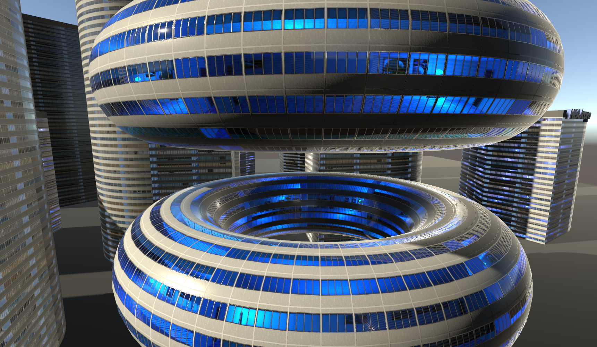
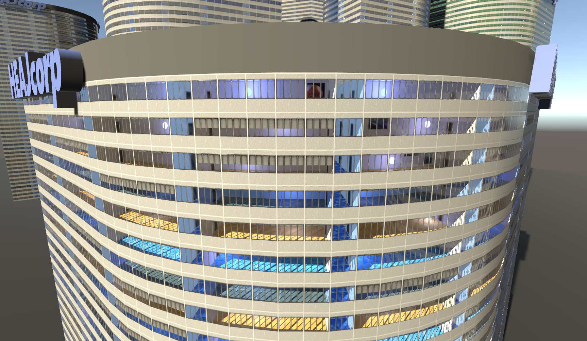
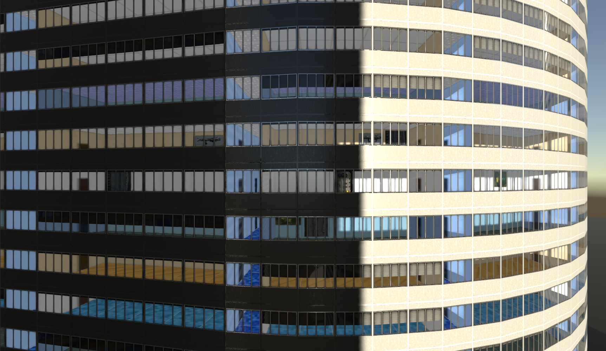

# Unity-InteriorMapping
============

This is an implementation of the interior mapping shader in tangent space for unity. It support basic features like rooms variations, room size, various windows models (windows blinds positions ...) as well as some advanced features like windows refraction, corridors between rooms, light projected from the windows, shadows from external occluders (works for directional light), funky bouncing sphere and random decorations placement. 

  
  
  

This project is provided as as, for learning purpose.
You can use it freely in commercial and personnal projects
No support will be provided ... it has been only tested on windows/DX11 platform so far.

The shader requires :

*An interior atlas with the albedo of the interior ... 4x4 textures:
	- first column is the ground texture
	- second column is the ceiling texture
	- third one is the sidewall texture (streched x2)
	- fourth one is the backwall texture (stretched x2)
*window atlas with 4 variations of the window (open->closed window blinds)
*window normal map
*window Roughness/Metalness/Glass texture (glass is used as mask for some effects in the shader.)

Optional :
*Decoration atlas with 4 walls random feature/poster/whatever you want ... 

I hope you'll enjoy it, have fun!

A samples scene is provided with several variations of the shader.
